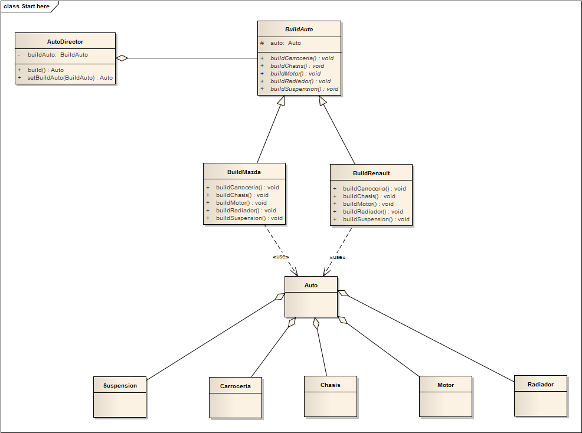

# PatternBuilder-Example

Este tipo de patrones abstraen el proceso de creación de instancias, con el fin de hacer sistemas independientes de cómo se crean, se componen y se representan sus objetos.

El patrón Builder es un patrón creacional cuyo objetivo es instanciar objetos complejos que generalmente están compuestos por varios elementos independientes que contribuyen individualmente a la creación y que admiten diferentes representaciones, para luego ensamblar con objeto mencionado. Centralizado el proceso de creación en un único punto, de tal forma que el mismo proceso de construcción pueda crear representaciones diferentes.
